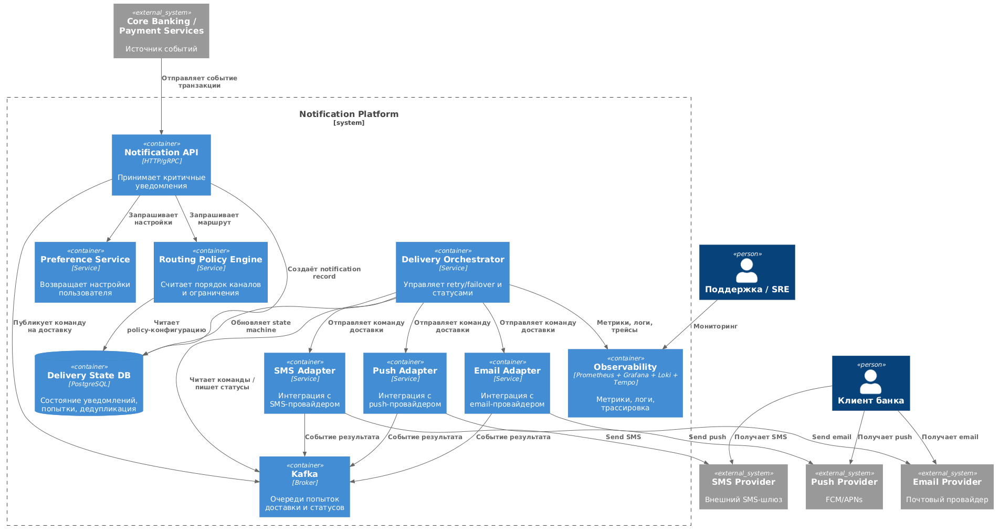
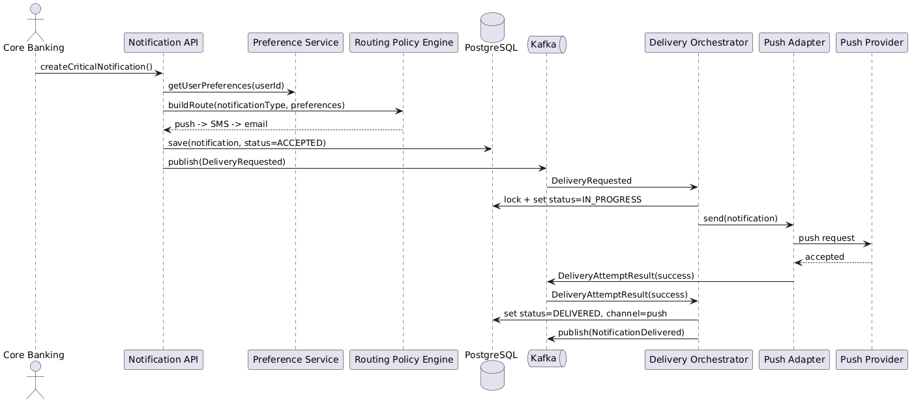
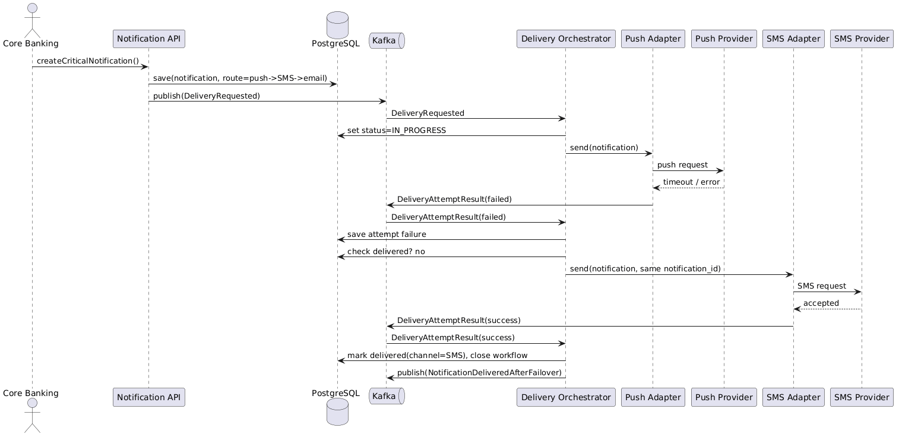
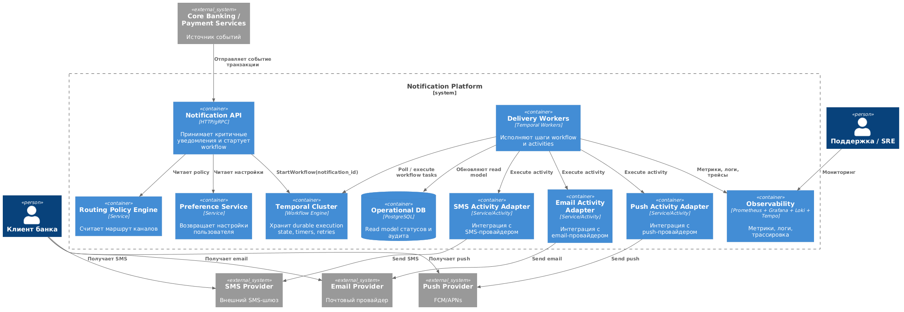
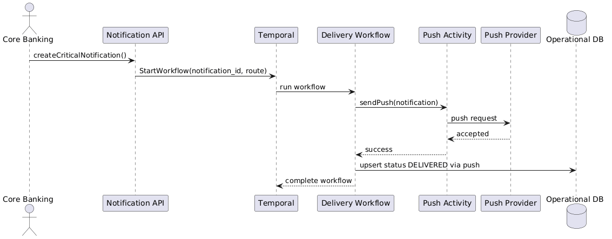
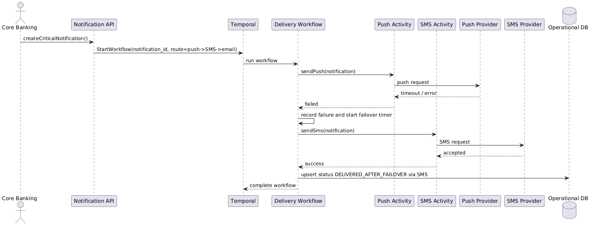

# Notification Platform для онлайн-банка


## 1. Функциональные требования

1. Платформа должна принимать уведомления от всех внутренних систем банка через единый механизм, чтобы команды не отправляли их каждая по-своему.

2. Платформа должна различать транзакционные, сервисные и маркетинговые уведомления и обрабатывать их по разным правилам.

3. Платформа должна учитывать настройки пользователя:
   маркетинговые уведомления можно отключать, сервисные тоже можно отключать частично, а транзакционные отключать полностью нельзя.

4. Для критичных транзакционных уведомлений система должна обеспечивать доставку хотя бы по одному каналу, а при сбое основного канала автоматически переключаться на резервный.

5. Система не должна отправлять пользователю одно и то же уведомление несколько раз из-за повторного запроса, ретрая или failover.

6. Платформа должна поддерживать массовые рассылки и при этом не мешать доставке критичных уведомлений.

7. По каждому уведомлению система должна хранить и показывать статус: принято, отправляется, доставлено, ошибка, переключено на резервный канал.

---

## 2. Нефункциональные требования

1. Транзакционные уведомления должны передаваться в канал доставки быстро: в норме до 2 секунд для большинства запросов.

2. Для критичных уведомлений платформа должна обеспечивать очень высокую надёжность доставки: хотя бы одно сообщение должно доходить почти во всех случаях, даже если отдельный провайдер временно недоступен.

3. Система должна выдерживать высокую нагрузку. Если взять вводные из задания, получается порядок около 100 млн уведомлений в день, поэтому архитектура должна поддерживать горизонтальное масштабирование и пиковую нагрузку с запасом.

4. Массовые маркетинговые рассылки не должны ухудшать скорость и надёжность доставки транзакционных уведомлений.

5. Платформа должна быть наблюдаемой: по каждому уведомлению нужно понимать, где оно находится, через какой канал пошло, на каком этапе произошла ошибка и был ли failover.

6. Система должна быть идемпотентной: повторная обработка одного и того же запроса не должна приводить к дублям.

7. Доступ к данным об уведомлениях должен быть защищён, а персональные данные не должны утекать в логи.

---

## 3. Архитектурно значимые требования

### 1. Низкая задержка для транзакционных уведомлений

Это важно, потому что пользователь ожидает почти мгновенное подтверждение перевода или списания. Такое требование сильно влияет на архитектуру: нельзя строить длинную синхронную цепочку, нужны быстрые очереди, приоритетная обработка и отдельный контур для критичных сообщений.

Связано с требованиями про быструю доставку, приоритет транзакционных уведомлений и изоляцию от массовых рассылок.

### 2. Гарантированная доставка при сбоях каналов и провайдеров

Это ключевое требование всей платформы. Если push или SMS-провайдер временно недоступен, система должна понять это, повторить попытку или переключиться на другой канал и при этом не отправить дубликат.

Связано с требованиями про надёжность, failover, отсутствие дублей и хранение статуса доставки.

### 3. Масштабируемость и разделение разных типов нагрузки

Маркетинговые рассылки и транзакционные сообщения имеют совершенно разный профиль нагрузки. Поэтому архитектура должна разделять их, чтобы миллионы рекламных сообщений не мешали нескольким, но очень важным критичным уведомлениям.

Связано с требованиями про масштабируемость, массовые кампании и приоритетную обработку.

---

## 4. Ключевые архитектурные вопросы

### 1. Как гарантировать доставку критичного уведомления хотя бы по одному каналу и не получить дубликаты?

Этот вопрос появляется из требований о надёжности доставки, failover и идемпотентности. Он важен, потому что ошибка здесь приводит либо к потере важного уведомления, либо к раздражающим дублям.

### 2. Как отделить массовые маркетинговые рассылки от транзакционного потока?

Этот вопрос появляется из требований о приоритетах, низкой задержке и высокой нагрузке. Он важен, потому что без такого разделения маркетинговые кампании будут мешать выполнению SLA для критичных уведомлений.

### 3. Где хранить состояние уведомления и попыток доставки?

Этот вопрос возникает из требований по статусам, наблюдаемости, аудиту и отсутствию дублей. Он важен, потому что без хранения истории нельзя нормально сделать failover, расследовать инциденты и контролировать качество доставки.

---

## 5. Архитектурные последствия этих требований

### Для быстрой доставки транзакционных уведомлений

- нужен отдельный приоритетный поток обработки;
- нужна асинхронная обработка через брокер сообщений;
- нельзя смешивать критичные уведомления с маркетинговыми в одной очереди.

### Для гарантированной доставки

- нужно хранить состояние уведомления и историю попыток;
- нужны ретраи и переключение на резервный канал;
- нужен механизм защиты от повторной отправки одного и того же уведомления.

### Для масштабируемости

- сервисы должны масштабироваться горизонтально;
- очереди и обработчики лучше разделить по типам уведомлений;
- маркетинговые кампании должны ограничиваться по скорости, чтобы не забивать систему.

### Для наблюдаемости и контроля

- у каждого уведомления должен быть уникальный идентификатор;
- нужны метрики, логи и трассировка по всей цепочке;
- должна сохраняться история действий для аудита и разбора проблем.

---

## 6. Какие архитектурные решения здесь не подходят

### 1. Прямая отправка уведомлений из бизнес-сервисов во внешние каналы

Если каждый банковский сервис сам отправляет SMS, email или push, то снова получится разрозненная система. В таком варианте сложно сделать единые правила, failover, защиту от дублей и нормальную наблюдаемость. Такое решение плохо подходит под требования по надёжности и централизованному контролю.

### 2. Одна общая очередь для всех типов уведомлений

Если и транзакционные, и маркетинговые уведомления попадут в одну очередь, то при массовой рассылке критичные сообщения начнут ждать вместе со всеми. Это нарушает требования по низкой задержке и приоритету важных уведомлений.

### 3. Хранить только финальный статус без истории попыток

Если система знает только итог "доставлено" или "ошибка", то она не сможет нормально объяснить, что происходило по дороге: были ли ретраи, был ли failover, какой провайдер упал. Это мешает и надёжности, и аудиту, и расследованию инцидентов.

---

## 7. Неопределённости и архитектурные риски

### 1. Не до конца понятны точные правила для разных видов транзакционных уведомлений

Пока неясно, одинаковые ли требования у подтверждения перевода, списания средств, входа в аккаунт и антифрод-уведомлений. Чтобы это проверить, нужно отдельно согласовать с бизнесом и безопасностью таблицу типов уведомлений, допустимых каналов и целевых SLA.

### 2. Неизвестны реальные ограничения внешних провайдеров

В условии сказано, что провайдеры могут быть нестабильны, но не сказано, какие у них лимиты, скорость ответа и доля ошибок. Проверять это нужно через пилот, нагрузочные тесты и получение SLA от поставщиков.

### 3. Не полностью определены пользовательские настройки

Из условия понятно, что часть уведомлений можно отключать, но не до конца ясно, какие именно сервисные сообщения должны остаться обязательными. Это нужно уточнить с продуктом и зафиксировать отдельной матрицей правил.

---

# RFC: Проектирование механизма гарантированной доставки критичных уведомлений с автоматическим failover между каналами доставки

| Метаданные | Значение |
|------------|----------|
| **Статус** | DESIGN |
| **Автор(ы)** | София Совкова |
| **Ответственный** | Команда Notification Platform |
| **Бизнес-заказчик** | Digital Banking / Платёжный контур |
| **Ревьюеры** | Архитектор платформы, команда мобильного банка, команда ИБ |
| **Дата создания** | 2026-04-07 |
| **Дата обновления** | 2026-04-07 |

---

## Оглавление

1. [Контекст](#контекст)
2. [Продуктовый анализ](#продуктовый-анализ)
3. [Пользовательские сценарии](#пользовательские-сценарии)
4. [Статистика](#статистика)
5. [Требования](#требования)
6. [Варианты решения](#варианты-решения)
7. [Сравнительный анализ](#сравнительный-анализ)
8. [Выводы](#выводы)
9. [Связанные задачи](#связанные-задачи)

---

## Контекст

Сейчас уведомления в банке отправляются неоднородно: разные команды используют разные интеграции с push, SMS и email-провайдерами. Для транзакционных уведомлений это особенно опасно, потому что их недоставка влияет не только на пользовательский опыт, но и на безопасность: пользователь может не узнать о списании, переводе или подтверждении операции.

Нужно спроектировать подсистему внутри Notification Platform, которая гарантирует доставку критичного уведомления хотя бы через один канал, автоматически переключается на резервный канал при отказе основного, не создаёт дубликатов и при этом старается минимизировать стоимость доставки. Для банка это важно сейчас по трём причинам:

1. Растёт объём операций и число жалоб на качество уведомлений.
2. Каналы доставки имеют разную цену и надёжность: push дешевле, SMS дороже, email медленнее и хуже подходит для срочных кейсов.
3. Внешние провайдеры могут деградировать частично, поэтому одной простой интеграции с каналом уже недостаточно.

Затронутые стороны:

- пользователи мобильного и веб-банка;
- платёжные и продуктовые сервисы, которые инициируют транзакционные события;
- команда поддержки и антифрод, которым нужна прозрачная история доставки;
- команда эксплуатации, которой нужны метрики, алерты и предсказуемое поведение при сбоях.

### Ключевые вопросы

- Как гарантировать доставку хотя бы по одному каналу без отправки дублей?
- Как быстро определить, что основной канал недоступен и пора переключаться?
- Как учитывать пользовательские предпочтения, не нарушая обязательность критичных уведомлений?
- Как сохранить низкую стоимость доставки, не жертвуя SLA?

---

## Продуктовый анализ

Подсистема относится только к критичным транзакционным уведомлениям. Это подтверждение перевода, списание средств, вход с нового устройства, подтверждение операции, уведомление о блокировке карты и другие события, где задержка или потеря сообщения заметны пользователю и значимы для безопасности.

Правила продукта для этой RFC:

1. Транзакционные уведомления нельзя отключить полностью.
2. Пользователь может выбрать предпочтительный канал, если он доступен для данного типа уведомления.
3. Если предпочтительный канал недоступен или не подтверждает приём в целевое время, система обязана использовать резервный канал.
4. Для срочных уведомлений приоритет каналов по умолчанию: `push -> SMS -> email`.
5. Email не считается основным каналом для срочных подтверждений, но допустим как последний резерв для части сценариев.
6. Если у пользователя нет активного push-токена, система сразу начинает с SMS.

Продуктовая цель подсистемы:

- повысить вероятность того, что пользователь узнает о критичном событии почти сразу;
- сохранить баланс между надёжностью и стоимостью;
- дать поддержку и эксплуатации точную картину: что отправлялось, когда был failover и чем всё закончилось.

---

## Пользовательские сценарии

| Приоритет | Тип сценария | Действующее лицо | Сценарий |
|-----------|--------------|------------------|----------|
| MUST HAVE | Основной | Клиент банка | После перевода клиент почти сразу получает push-уведомление о результате операции. |
| MUST HAVE | Failover | Клиент банка | Если push не доставлен или провайдер push недоступен, система автоматически отправляет SMS без участия пользователя. |
| MUST HAVE | Настройки | Клиент банка | Клиент выбирает предпочтительный канал для транзакционных уведомлений, но не может отключить их полностью. |
| MUST HAVE | Операционный | Сотрудник поддержки | Поддержка видит историю попыток доставки: основной канал, время ожидания, факт failover, итоговый статус. |
| SHOULD HAVE | Операционный | SRE / on-call | Эксплуатация получает алерт, если доля failover или ошибок по провайдеру превышает порог. |
| SHOULD HAVE | Безопасность | Антифрод | Команда безопасности может проверить, каким каналом и когда было доставлено уведомление о подозрительной операции. |
| COULD HAVE | Аналитика | Product analyst | Аналитик сравнивает стоимость и эффективность разных каналов для транзакционных уведомлений. |

**Приоритеты:**

- **MUST HAVE** — обязательно к реализации
- **SHOULD HAVE** — желательно реализовать
- **COULD HAVE** — можно добавить после запуска ядра решения

---

## Статистика

Исходные вводные из задания:

- MAU: `10 млн`
- DAU: `3 млн`
- Peak Concurrent Users: `300 000`
- Среднее количество транзакционных уведомлений: `2` на пользователя в день

Расчёт объёма для критичных уведомлений:

1. Суточный объём транзакционных уведомлений:

```text
3 000 000 DAU * 2 = 6 000 000 транзакционных уведомлений в день
```

2. Средняя нагрузка в секунду:

```text
6 000 000 / 86 400 ≈ 69 уведомлений/сек
```

3. Пиковая нагрузка.

Для платёжных систем среднее значение мало полезно, потому что транзакционные события концентрируются по времени: утром, вечером, в дни выплат, в период акций и в момент инцидентов. Для расчёта берём:

- коэффициент пика `x20` к среднему как рабочий запас для событийного трафика;
- дополнительный запас `x2` на кратковременные всплески, ретраи и failover.

```text
69 * 20 * 2 ≈ 2 760 попыток/сек
```

Округляем проектную пиковую нагрузку подсистемы до:

- `3 000 сообщений/сек` на входе;
- до `4 500 попыток доставки/сек` с учётом ретраев и failover;
- до `10 000 событий/сек` в журнале статусов и аудита.

4. Оценка стоимости влияния failover.

Если в норме `90%` транзакционных уведомлений уходят через push, `9%` через SMS и `1%` через email, то при деградации push доля SMS может резко вырасти. Поэтому система должна:

- уметь вводить circuit breaker для проблемного канала;
- быстро переключать трафик на SMS;
- ограничивать повторные попытки по заведомо деградировавшему провайдеру.

---

## Требования

### Функциональные требования

| № | Приоритет | Обозначение | Требование |
|---|-----------|-------------|------------|
| 1 | MUST HAVE | FR1 | Подсистема принимает критичное уведомление от внутренних сервисов через единый API или событие в шине. |
| 2 | MUST HAVE | FR2 | Для каждого уведомления система вычисляет допустимый порядок каналов доставки на основе типа события, пользовательских настроек и доступности каналов. |
| 3 | MUST HAVE | FR3 | Если основной канал не подтверждает успешную отправку в заданное время или возвращает ошибку, система автоматически запускает failover на следующий канал. |
| 4 | MUST HAVE | FR4 | Система гарантирует, что одно и то же уведомление не будет доставлено пользователю повторно из-за ретраев, повторной публикации события или failover. |
| 5 | MUST HAVE | FR5 | Для каждого уведомления хранится история состояний и попыток: какой канал выбран, какой провайдер вызван, какой результат получен, когда был failover. |
| 6 | MUST HAVE | FR6 | Система учитывает пользовательские настройки: транзакционные уведомления обязательны, но пользователь может указать предпочтительный канал, если он разрешён правилами продукта. |
| 7 | SHOULD HAVE | FR7 | Система поддерживает A/B или policy-конфигурацию порядка каналов для разных типов транзакционных уведомлений. |
| 8 | SHOULD HAVE | FR8 | Система умеет временно исключать провайдера или канал из маршрута при массовой деградации. |
| 9 | COULD HAVE | FR9 | Система строит отчёт по стоимости доставки, количеству failover и доле успешной доставки по каналам. |

### Нефункциональные требования

| № | Приоритет | Обозначение | Требование |
|---|-----------|-------------|------------|
| 1 | MUST HAVE | NFR1 | Для транзакционных уведомлений `p95` от приёма до первой попытки доставки не более `2 секунд`, `p99` не более `5 секунд`. |
| 2 | MUST HAVE | NFR2 | Успешная доставка хотя бы по одному каналу для критичных уведомлений не ниже `99.95%` за месяц. |
| 3 | MUST HAVE | NFR3 | Система должна выдерживать `3 000 входящих уведомлений/сек` и до `4 500 попыток доставки/сек` с горизонтальным масштабированием. |
| 4 | MUST HAVE | NFR4 | Повторная обработка уведомления с тем же `notification_id` или `idempotency_key` не должна приводить к повторной доставке. |
| 5 | MUST HAVE | NFR5 | Для `100%` уведомлений должны быть доступны trace id, журнал статусов, метрики по каналу, провайдеру и маршруту failover. |
| 6 | MUST HAVE | NFR6 | Переключение на резервный канал должно происходить автоматически без участия оператора. |
| 7 | SHOULD HAVE | NFR7 | Деградация одного провайдера не должна приводить к каскадной деградации всей подсистемы; нужны rate limiting и circuit breaker. |
| 8 | SHOULD HAVE | NFR8 | Стоимость доставки должна минимизироваться автоматически: система предпочитает более дешёвый и достаточно надёжный канал, если это не нарушает SLA. |
| 9 | MUST HAVE | NFR9 | Персональные данные в логах должны маскироваться, а доступ к истории доставки должен быть ограничен ролями. |

### Архитектурно значимые требования (ASR)

| Приоритет | Обозначение | Требование | Почему важно |
|-----------|-------------|------------|--------------|
| High | ASR1 | Низкая задержка первой попытки доставки | Влияет на выбор асинхронной архитектуры, очередей и на объём логики на критическом пути. |
| High | ASR2 | Гарантированная доставка с кросс-канальным failover | Требует хранения состояния, retry/failover orchestration и чётких правил завершения сценария. |
| High | ASR3 | Отсутствие дублей при ретраях и failover | Определяет модель идемпотентности, блокировок и статусов доставки. |
| High | ASR4 | Наблюдаемость и аудит | Требует сквозного trace id, event log и сохранения всех попыток доставки. |
| Medium | ASR5 | Контроль стоимости доставки | Влияет на policy engine и порядок каналов по умолчанию. |
| Medium | ASR6 | Устойчивость к деградации провайдеров | Требует circuit breaker, health-based routing и быстрой смены маршрута. |

**Расчёт нагрузок:**

```text
DAU = 3 000 000
Транзакционные уведомления = 2 на пользователя в день
Суточный объём = 6 000 000
Среднее RPS = 6 000 000 / 86 400 ≈ 69

Проектный peak input = 3 000 уведомлений/сек
Проектный peak delivery attempts = 4 500 попыток/сек
Проектный peak status events = 10 000 событий/сек

Размер одной записи статуса ~ 1 КБ
10 000 событий/сек ≈ 10 МБ/сек логического потока статусов
≈ 864 ГБ/сутки сырого event потока до компрессии и retention policy
```

Вывод по нагрузке:

- Брокер сообщений и слой обработки должны быть распределёнными.
- История попыток не должна храниться только в оперативной памяти.
- Требуется отдельная стратегия retention: подробная история в горячем слое ограниченное время, агрегаты и аудит дольше.

---

## Варианты решения

### Вариант 1: Собственный Delivery Orchestrator + Kafka + PostgreSQL

> **Описание:** отдельный сервис-оркестратор управляет состоянием уведомления, хранит state machine в PostgreSQL, публикует команды в Kafka и вызывает channel adapters для push, SMS и email.

#### Архитектура

Компоненты:

- `Notification API` принимает запрос или событие от внутреннего сервиса.
- `Preference Service` отдаёт настройки пользователя и доступные каналы.
- `Routing Policy Engine` вычисляет маршрут вида `push -> SMS -> email`.
- `Delivery Orchestrator` создаёт state machine доставки и управляет failover.
- `Kafka` разделяет входящий поток, попытки доставки и события статусов.
- `Channel Adapters` инкапсулируют интеграции с push/SMS/email-провайдерами.
- `Delivery State DB (PostgreSQL)` хранит текущее состояние уведомления, попытки доставки и дедупликацию.
- `Observability Stack` собирает метрики, логи, трейсинг и аудит.

#### C4 Container Diagram




#### Основной сценарий доставки



#### Сценарий failover




#### Как вариант выполняет ASR

| ASR | Как выполняется |
|-----|-----------------|
| ASR1 | Критический путь короткий: приём, расчёт маршрута, публикация в Kafka; канал вызывается асинхронно. |
| ASR2 | Оркестратор хранит state machine и запускает следующий канал по таймауту или ошибке. |
| ASR3 | Идемпотентность обеспечивается `notification_id`, уникальными ключами попыток и блокировкой записи состояния. |
| ASR4 | Каждый переход состояния пишется в БД и observability stack. |
| ASR5 | Policy engine выбирает сначала дешёвый и быстрый канал, если это допустимо для сценария. |
| ASR6 | Для каждого адаптера можно включить circuit breaker и временно исключать провайдера из маршрута. |

#### Технологии

- API / Orchestrator / Adapters: `Java/Kotlin + Spring Boot`
- Брокер: `Apache Kafka`
- Основная БД состояния: `PostgreSQL`
- Кэш и rate limit state: `Redis`
- Метрики: `Prometheus + Grafana`
- Логи: `Loki`
- Трейсинг: `Tempo` или `Jaeger`
- CDC / outbox при необходимости: `Debezium`

#### Масштаб системы и ожидаемая нагрузка

- `3 000 входящих уведомлений/сек`
- `4 500 попыток доставки/сек`
- до `10 000 status events/сек`
- PostgreSQL должен выдерживать frequent writes по state machine, поэтому запись стоит шардировать логически по `notification_id` и ограничивать время хранения горячей истории

#### Этапы реализации

| Этап | Описание | Планируемый срок | Ресурсы | Риски |
|------|----------|------------------|---------|-------|
| 1 | Notification API, state model, PostgreSQL schema, Kafka topics | 3 недели | 2 backend, 1 architect | Ошибки в модели состояний |
| 2 | Push/SMS adapters, retry/failover logic | 3 недели | 2 backend | Неочевидные ответы провайдеров |
| 3 | Observability, audit UI/API, circuit breaker | 2 недели | 1 backend, 1 SRE | Недостаточная детализация метрик |
| 4 | Нагрузочные и chaos-тесты | 2 недели | 1 QA, 1 SRE | Реальные лимиты провайдеров отличаются от ожиданий |

#### Преимущества

- Полный контроль над логикой и моделью данных.
- Хорошо ложится на уже привычный стек Kafka + PostgreSQL.
- Проще внедрять поэтапно и интегрировать с остальной платформой.
- Нет новой сложной платформенной зависимости уровня workflow engine.

#### Недостатки

- Сложную оркестрацию, таймауты и state machine нужно разрабатывать и поддерживать самостоятельно.
- Выше риск ошибок в edge-case сценариях: повторная доставка, recovery после рестарта, race conditions.
- Со временем код оркестратора может стать трудно поддерживаемым.

---

### Вариант 2: Durable Workflow на Temporal

> **Описание:** логика доставки реализуется как долговечный workflow в Temporal. Каждое уведомление становится workflow-экземпляром, который хранит состояние, таймеры, retry и failover на уровне workflow engine.

#### Архитектура

Компоненты:

- `Notification API` принимает событие и стартует workflow.
- `Temporal` хранит состояние выполнения, таймеры и историю шагов.
- `Preference Service` и `Routing Policy Engine` используются до старта или внутри workflow.
- `Delivery Activities` отправляют уведомления через push/SMS/email adapters.
- `Operational DB` хранит срезовое состояние для быстрых запросов поддержки и аналитики.
- `Observability Stack` собирает метрики workflow и delivery activities.

#### C4 Container Diagram


#### Основной сценарий доставки



#### Сценарий failover


#### Как вариант выполняет ASR

| ASR | Как выполняется |
|-----|-----------------|
| ASR1 | Первая попытка быстрая, а таймеры и ретраи обрабатываются внутри Temporal без отдельной самописной логики. |
| ASR2 | Failover описывается как workflow со встроенными durable timers и retry semantics. |
| ASR3 | Повторный запуск по тому же `workflow_id = notification_id` естественно поддерживает идемпотентность на уровне workflow. |
| ASR4 | История workflow уже фиксирует все переходы; read model синхронизируется для поддержки и отчётности. |
| ASR5 | Workflow использует policy-функцию выбора канала, учитывая стоимость и доступность. |
| ASR6 | При деградации провайдера activity быстро падает, а workflow переводит уведомление на следующий канал. |

#### Технологии

- API и workers: `Java/Kotlin` или `Go`
- Workflow engine: `Temporal`
- Read model / audit view: `PostgreSQL`
- Метрики и логи: `Prometheus + Grafana + Loki`
- Трейсинг: `OpenTelemetry + Tempo/Jaeger`
- Activity adapters: отдельные сервисы или in-process activities

#### Масштаб системы и ожидаемая нагрузка

- `3 000 workflow starts/сек` в пике
- до `4 500 activity executions/сек`
- высокая нагрузка на history storage Temporal, нужно отдельно считать retention и размер кластера
- нужно контролировать рост workflow history при сложных retry/failover цепочках

#### Этапы реализации

| Этап | Описание | Планируемый срок | Ресурсы | Риски |
|------|----------|------------------|---------|-------|
| 1 | Развёртывание Temporal, шаблон workflow, старт API | 4 недели | 2 backend, 1 platform engineer | Новая технология для команды |
| 2 | Activities для push/SMS/email, read model | 3 недели | 2 backend | Сложность отладки на раннем этапе |
| 3 | Метрики, alerting, policy tuning | 2 недели | 1 backend, 1 SRE | Недостаток экспертизы по эксплуатации Temporal |
| 4 | Нагрузочные и отказоустойчивые тесты | 2 недели | 1 QA, 1 SRE | Ошибки sizing кластера Temporal |

#### Преимущества

- Durable execution, таймеры и recovery уже решены платформенно.
- Проще моделировать сложные сценарии ретраев и failover.
- Меньше самописного кода вокруг state machine.
- Хорошая читаемость бизнес-потока доставки.

#### Недостатки

- Более высокая стоимость внедрения и эксплуатации.
- Для команды это новая инфраструктурная зависимость.
- Нужна зрелая platform/SRE-поддержка Temporal.
- Возникает отдельный слой read model, потому что history workflow не всегда удобно использовать напрямую для продуктовых запросов.

---

## Сравнительный анализ

### Ресурсные требования

| Критерий | Вариант 1 | Вариант 2 |
|----------|-----------|-----------|
| Время реализации | 10 недель | 11-12 недель |
| Команда | 2-3 backend, 1 architect, 1 SRE, 1 QA | 2-3 backend, 1 platform engineer, 1 SRE, 1 QA |
| Инфраструктура | Kafka, PostgreSQL, Redis, observability stack | Temporal cluster, PostgreSQL, observability stack |
| Организационные риски | Ошибки в самописной оркестрации и recovery логике | Новая технология, выше порог входа и операционная сложность |

### Соответствие требованиям

| Требование | Вариант 1 | Вариант 2 |
|------------|-----------|-----------|
| FR1 | ✅ Да | ✅ Да |
| FR2 | ✅ Да | ✅ Да |
| FR3 | ✅ Да | ✅ Да |
| FR4 | ✅ Да | ✅ Да |
| FR5 | ✅ Да | ✅ Да |
| FR6 | ✅ Да | ✅ Да |
| FR7 | ✅ Да | ✅ Да |
| FR8 | ✅ Да | ✅ Да |
| NFR1 | ✅ Да, при аккуратной реализации | ✅ Да, при правильном sizing Temporal |
| NFR2 | ✅ Да | ✅ Да |
| NFR3 | ✅ Да | ✅ Да |
| NFR4 | ✅ Да | ✅ Да |
| NFR5 | ✅ Да | ✅ Да |
| NFR6 | ✅ Да | ✅ Да |
| NFR7 | ✅ Да | ✅ Да |
| NFR8 | ✅ Да | ✅ Да |
| NFR9 | ✅ Да | ✅ Да |

### Качественное сравнение trade-off

| Критерий | Вариант 1: свой orchestrator | Вариант 2: Temporal |
|----------|------------------------------|---------------------|
| Скорость первого запуска | Выше, если команда уже умеет Kafka/PostgreSQL | Ниже из-за внедрения новой платформы |
| Гибкость бизнес-логики | Высокая, но ценой самописной сложности | Очень высокая, workflow читаемы и удобны |
| Эксплуатационная сложность | Средняя | Выше |
| Риск ошибок в edge cases | Выше | Ниже |
| Стоимость поддержки в долгую | Средняя/высокая при росте логики | Средняя при наличии сильной платформенной команды |
| Зависимость от новой технологии | Низкая | Высокая |

---

## Выводы

> **Рекомендация:** выбрать **Вариант 1: собственный Delivery Orchestrator на Kafka + PostgreSQL** как основной для внедрения.

**Обоснование выбора:**

Для данной задачи важны не только архитектурная “красота”, но и реалистичность внедрения. Вариант с Temporal выглядит технологически сильнее с точки зрения durable workflows и надёжной оркестрации, но он требует зрелой платформенной команды, отдельной эксплуатации и новой экспертизы. Для учебного кейса и для команды, у которой уже есть Kafka/PostgreSQL, более рационален собственный orchestrator.

Почему выбран именно Вариант 1:

1. Он полностью закрывает обязательные требования и ASR.
2. Его проще внедрять постепенно внутри существующей Notification Platform.
3. Он использует понятный и широко распространённый стек.
4. Его легче объяснить и защитить как практичный компромисс между надёжностью, стоимостью и сроками.

Какие компромиссы принимаются:

- мы сознательно отказываемся от готового workflow engine и берём на себя часть сложности по state machine;
- за это получаем меньший инфраструктурный риск и более простой путь запуска;
- чтобы компенсировать недостатки, нужно строго описать модель состояний, использовать outbox/idempotency, проводить chaos- и race-condition тесты и сразу заложить observability.

Ограничения выбранного решения:

- логика failover не должна бесконтрольно разрастаться внутри одного сервиса;
- нужно ограничить число попыток и длительность маршрута, чтобы не уходить в дорогие и бессмысленные ретраи;
- для некоторых типов уведомлений потребуется отдельная policy-матрица каналов и SLA.

Критерии успешности после внедрения:

- доставка хотя бы по одному каналу не ниже `99.95%`;
- `p95` первой попытки не хуже `2 секунд`;
- доля необъяснимых дублей стремится к нулю;
- поддержка и SRE могут по trace id восстановить историю любого критичного уведомления.

---

## Связанные задачи

1. Утвердить матрицу транзакционных уведомлений: тип события, обязательность, порядок каналов, SLA.
2. Описать state machine доставки и таблицы хранения статусов.
3. Реализовать idempotency и deduplication policy.
4. Подготовить интеграционные контракты с push, SMS и email-провайдерами.
5. Настроить метрики, алерты и дашборды для failover rate, latency и provider error rate.
6. Провести нагрузочное тестирование на `3 000 входящих уведомлений/сек`.
7. Провести chaos-тестирование с отключением push-провайдера и проверкой автоматического failover.

---

## Приложения

### Глоссарий

| Термин | Определение |
|--------|-------------|
| Критичное уведомление | Транзакционное уведомление, недоставка которого влияет на безопасность или пользовательский опыт |
| Failover | Автоматическое переключение на резервный канал доставки после ошибки или таймаута основного |
| Delivery attempt | Одна попытка отправки уведомления через конкретный канал и провайдера |
| Idempotency | Свойство системы не выполнять повторную доставку при повторной обработке одного и того же запроса |
| Routing policy | Набор правил выбора порядка каналов доставки |
